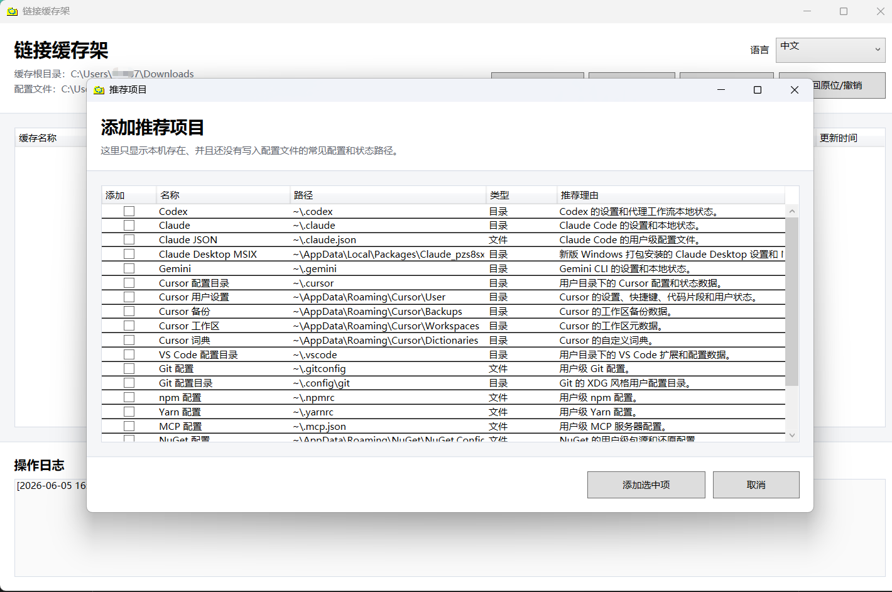
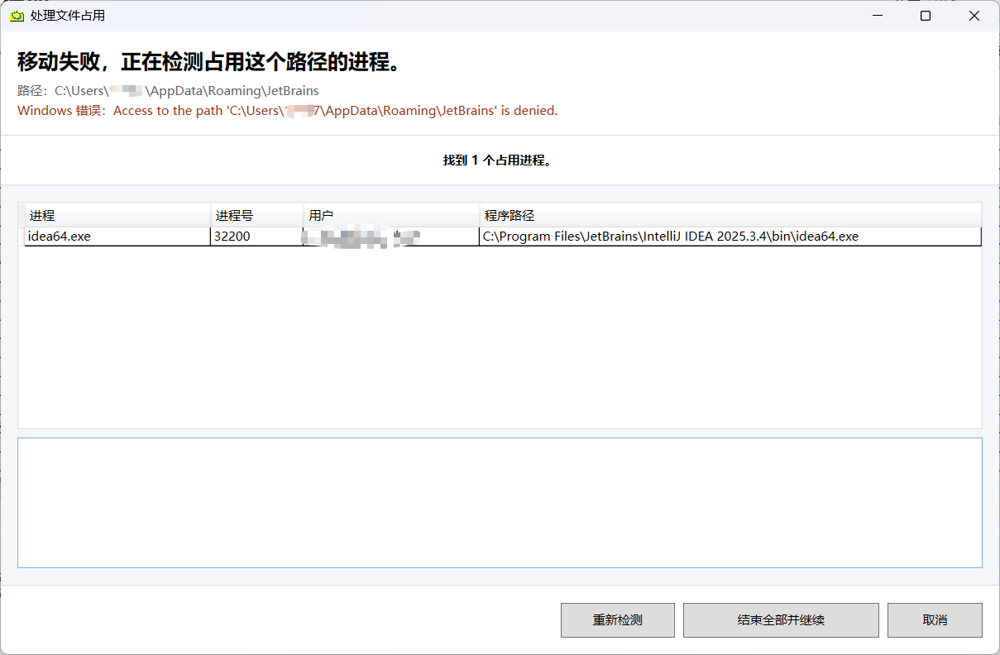

# Link Shelf


[中文主页](README.md)

Portable app-state shelf for Windows: collect scattered configuration and small state paths into one syncable root, while apps keep using their original paths through symbolic links.

Link Shelf is a Windows desktop and command-line tool for relocating application state, developer settings, AI coding tool profiles, terminal/editor configuration, and small working directories into a folder you can back up, sync, or move between machines.

Keywords: Windows symbolic link manager, symlink backup, hard link projection, dotfiles manager for Windows, portable app state, developer settings sync, AI coding tool config sync, Syncthing companion.

**Download:** [LinkShelf.exe](https://github.com/xiayukun/LinkShelf/releases/latest/download/LinkShelf.exe) | [Latest release](https://github.com/xiayukun/LinkShelf/releases/latest)


## Quick Start

1. Download [`LinkShelf.exe`](https://github.com/xiayukun/LinkShelf/releases/latest/download/LinkShelf.exe) from the release page.
2. Put it inside the folder you want to use as your cache root.
3. Double-click `LinkShelf.exe`.
4. Click `Add item`.
5. Choose a file or directory.
6. Let Link Shelf move it into the cache root and create a symbolic link at the original path.

On another machine, put `LinkShelf.exe` in the synced or restored cache root and click `Restore links`.

## Table of Contents

- [Why It Exists](#why-it-exists)
- [Features](#features)
- [Install](#install)
- [GUI Usage](#gui-usage)
- [CLI Usage](#cli-usage)
- [AI and Automation](#ai-and-automation)
- [Configuration](#configuration)
- [Runtime Folders](#runtime-folders)
- [Privacy](#privacy)
- [Build From Source](#build-from-source)
- [Good Fit](#good-fit)
- [Not a Good Fit](#not-a-good-fit)
- [Recommended With Syncthing](#recommended-with-syncthing)
- [Roadmap](#roadmap)
- [Contributing](#contributing)
- [Maintainer Docs](#maintainer-docs)
- [Acknowledgements](#acknowledgements)
- [License](#license)

## Why It Exists

Many tools store important state outside your projects:

- editor settings
- command-line tool profiles
- model-agent configuration
- package manager config files
- small application data folders

Link Shelf lets you place those paths on a "shelf" that can be backed up, synced, moved to another machine, or inspected as a single directory.

Syncthing is the recommended companion, but not a requirement. You can also use Link Shelf with cloud drives, backup software, external disks, network shares, or any workflow where one folder is easier to manage than scattered paths.

## Features

- Add one or more files or directories into the cache root.
- Create symbolic links at the original locations.
- Restore all configured links on another Windows machine.
- Detect broken links, missing cache items, wrong link targets, and target-path conflicts.
- Resolve conflicts interactively, one item at a time.
- Add detected recommended paths such as Cursor, VS Code, Git, npm, Codex, Claude, JetBrains, and Clash state.
- Collect AI coding tool state for Codex, Claude, Gemini, Cursor, Cline, Roo Code, Continue, aider, Windsurf, and GitHub Copilot when those paths exist locally.
- When Windows blocks an add, restore, or move back / undo operation with `Access denied`, detect processes that are using the target path and offer to terminate them before retrying.
- Move selected items back to their original paths and remove their cache/config records.
- Project the app into another folder with a hard link so that folder can act as a separate cache root without copying the full executable.
- Use the same executable as a GUI app or a CLI checker.
- Store portable paths with `~` so user-profile folders work across machines.
- Use English config, logs, executable names, and folders.
- Switch the UI between English and Chinese with automatic language selection from the current Windows UI culture.

## Install

Download the latest [`LinkShelf.exe`](https://github.com/xiayukun/LinkShelf/releases/latest/download/LinkShelf.exe) from the release page and place it inside the folder you want to manage as your cache root.

Example:

```powershell
C:\Users\you\AppData\Local\LinkShelf\LinkShelf.exe
```

The executable uses its own folder as the cache root. This is intentional: the tool and the managed cache travel together.

## GUI Usage

Double-click `LinkShelf.exe`.

The GUI asks for administrator permission because Windows symbolic links usually require elevation unless Developer Mode grants the current user link creation rights.

Common workflow:

1. Click `Add item`.
2. Choose `Add recommended items`, `Add directory`, or `Add file`.
3. Pick one or more original paths.
4. Link Shelf moves it into the cache root.
5. Link Shelf creates a symbolic link at the original path.
6. Sync, back up, or move the cache root with your preferred tool.

Recommended items only show paths that exist on the current machine and are not already in `link-shelf.config.json`. The built-in list is curated from the author's daily Windows setup and AI-assisted web research into common developer, AI coding, editor, terminal, and package-manager configuration paths. Selecting a recommended item runs the same add flow as choosing that path manually.

Some recommended paths can contain account names, tokens, local history, or other private state. Review the folder before syncing it with Syncthing, a cloud drive, or another tool.



On a second machine:

1. Put `LinkShelf.exe` in the synced cache root.
2. Double-click it.
3. Click `Restore links`.
4. Resolve any target-path conflicts.

If a config record exists but the cache item is missing, `Restore links` can still import real content from the original path when that content exists. In that case, cache-based choices are disabled because there is no cache content to use.

If the cache root contains a file or folder that is not in `link-shelf.config.json`, Link Shelf shows it as an extra cache item. Select it and click `Restore links` to choose an original path; Link Shelf saves the config record first, then asks how to handle any conflict at that path.

### Locked Paths

When adding a file or directory, Link Shelf first tries the normal move. If Windows reports `Access denied`, Link Shelf opens a locked-path recovery window and scans the selected path for running programs that are using it.

From that window, you can review the processes, terminate selected processes from the context menu, or click `Terminate all and continue`. Link Shelf then waits briefly and retries the same move operation. If the path is still blocked, the same recovery window appears again.

The same recovery window is also used when `Restore links` or `Move back / Undo` fails with `Access denied`, so locked target paths can be handled before retrying the operation.



### Project App

Click `Project app` next to the language selector to create a hard link to `LinkShelf.exe` in another folder. Launching the projected executable uses that folder as its cache root, so you can manage a separate cache root without storing a second full copy of the single-file executable.

Projection uses a Windows hard link, so the target folder must be on the same drive as the current `LinkShelf.exe`. Link Shelf will not overwrite an existing `LinkShelf.exe` in the selected folder.

### Move Back / Undo

Select one or more rows and click `Move back / Undo` to remove the original link, move the cached content back to its original path, and remove the config record. Link Shelf only does this when the original path is missing or is still the expected link to the cache item. If real content exists at the original path, the undo is skipped to avoid overwriting user data. If Windows blocks the link removal or move with `Access denied`, the locked-path recovery window opens before retrying.

If the cache item is already missing, Link Shelf asks whether to remove only the config record. Confirming that prompt does not move or delete any external file or folder.

If the selected row is an extra cache item with no config record, `Move back / Undo` warns that Link Shelf does not know its destination and can delete only that cache item from the cache root.

## CLI Usage

The same executable supports automation-friendly commands:

```powershell
.\LinkShelf.exe check
.\LinkShelf.exe check --json
.\LinkShelf.exe check --verbose
.\LinkShelf.exe status
.\LinkShelf.exe cache-root
.\LinkShelf.exe version
.\LinkShelf.exe help
.\LinkShelf.exe -help
```

Exit codes:

- `0`: all checked items are healthy
- `1`: one or more problems were found
- `2`: command error or application error

Recommended automation command:

```powershell
.\LinkShelf.exe check --json
```

Only notify the user when `problemCount` is greater than `0`.

## AI and Automation

Link Shelf is useful when AI coding tools store important local state outside your projects. It can place Codex, Claude, Gemini, Cursor, Cline, Roo Code, Continue, aider, Windsurf, GitHub Copilot, and editor settings into one cache root, then restore the original paths with symbolic links on another Windows machine.

For a user's AI assistant, the safest way to inspect Link Shelf is the CLI:

```powershell
.\LinkShelf.exe cache-root
.\LinkShelf.exe check --json
.\LinkShelf.exe help
```

Prompt you can give to an AI assistant:

```text
I use Link Shelf on Windows to move scattered app state, dotfiles, AI coding tool settings, and small config folders into one cache root, then restore the original paths with symbolic links.

First run `LinkShelf.exe cache-root` to locate the cache root.
Then run `LinkShelf.exe check --json` and explain only unhealthy items.
Do not move, delete, overwrite, restore, or relink anything unless I explicitly ask.
If I ask you to recommend paths, prefer developer tools, AI coding tools, editors, terminals, package managers, and small app-state folders. Warn me before syncing secrets, tokens, local history, or account-specific files.
```

This repository includes [AGENTS.md](AGENTS.md) for AI coding agents that maintain the source code. If you use Codex or another coding agent to maintain the project, let the agent read `AGENTS.md` first so it understands the product goal, safety rules, config schema, and release workflow.

Codex automation is also a good fit for day-to-day link health monitoring. A scheduled automation can run:

```powershell
.\LinkShelf.exe check --json
```

Recommended behavior:

- Run the command on a timer from the cache root.
- Parse the JSON output.
- Stay quiet when `problemCount` is `0`.
- Notify the user when `problemCount` is greater than `0`, because that usually means a link is missing, points to the wrong place, or the cache item is gone.

## Configuration

Link Shelf writes:

```text
link-shelf.config.json
```

The current schema uses English keys:

```json
{
  "version": 2,
  "cacheId": "generated-id",
  "updatedAt": "2026-06-04 19:00:00",
  "items": [
    {
      "cacheName": ".codex",
      "originalPath": "~\\.codex",
      "type": "directory",
      "linkMode": "symbolic-link",
      "status": "enabled",
      "sourceMachine": "DESKTOP",
      "createdAt": "2026-06-04 19:00:00",
      "updatedAt": "2026-06-04 19:00:00",
      "lastOperation": "add-sync-item",
      "note": ""
    }
  ]
}
```

Existing old config files are not migrated automatically. Rename or recreate the config as `link-shelf.config.json` before using this version.

## Runtime Folders

Link Shelf creates these folders inside the cache root:

```text
.link-shelf-logs
.link-shelf-backups
```

Backups are created before conflict handling moves or replaces existing content.

## Privacy

Link Shelf works locally. It does not upload files, paths, logs, configuration, or machine names to a remote service. If your cache root is synced with Syncthing, a cloud drive, or another tool, that tool is responsible for network transfer.

See [PRIVACY.md](PRIVACY.md) for details.

## Build From Source

Requirements:

- Windows
- .NET SDK

Build:

```powershell
dotnet build .\LinkShelf.csproj -c Release
```

Publish a single-file Windows executable:

```powershell
dotnet publish .\LinkShelf.csproj -t:Rebuild -c Release -r win-x64 --self-contained true -p:PublishSingleFile=true -p:EnableCompressionInSingleFile=true -p:IncludeNativeLibrariesForSelfExtract=true -p:DebugType=None -p:DebugSymbols=false -o .\dist
```

## Good Fit

Link Shelf is a good fit for:

- syncing developer tool settings across machines
- making application state easier to back up
- moving scattered config paths into one managed folder
- checking whether symlink-based setup is still healthy
- restoring links after reinstalling Windows or setting up a new computer

## Not a Good Fit

Link Shelf is not designed for:

- syncing very large application caches blindly
- replacing a version-control system
- replacing Syncthing, cloud sync, or backup software
- partially linking only some files inside a directory
- managing Windows shortcut files (`.lnk`), because they do not work reliably after being moved and linked back
- silently overwriting existing target content

## Recommended With Syncthing

Syncthing pairs well with Link Shelf:

- Syncthing syncs the cache root between machines.
- Link Shelf creates and restores local symbolic links.
- Syncthing ignore rules decide what should not be synced.

The directory itself remains the smallest managed unit in Link Shelf. Use Syncthing ignore rules for internal file exclusions.

## Roadmap

- Signed releases
- Safer first-run guide
- Optional dry-run mode for restore
- Exportable diagnostic report

## Contributing

Contributions are welcome. Start with [CONTRIBUTING.md](CONTRIBUTING.md), and keep file-moving behavior conservative: Link Shelf should never silently delete, overwrite, or merge user content.

For release planning and GitHub launch notes, see [docs/github-launch-checklist.md](docs/github-launch-checklist.md).

## Maintainer Docs

Maintainer-only launch, release, screenshot, signing, and handoff notes live in [docs](docs). Most users can ignore them. For signing options, see [Windows code signing](docs/windows-code-signing.md).

## Acknowledgements

The locked-path detection code is adapted from [ShowWhatProcessLocksFile](https://github.com/PolarGoose/ShowWhatProcessLocksFile) by PolarGoose.

The user workflow is also inspired by Microsoft PowerToys [File Locksmith](https://learn.microsoft.com/en-us/windows/powertoys/file-locksmith), an open-source PowerToys utility. See [THIRD-PARTY-NOTICES.md](THIRD-PARTY-NOTICES.md) for details.

Thanks to [Syncthing](https://github.com/syncthing/syncthing) for providing a reliable open-source sync tool. It is the recommended sync companion for Link Shelf.

## License

MIT.
