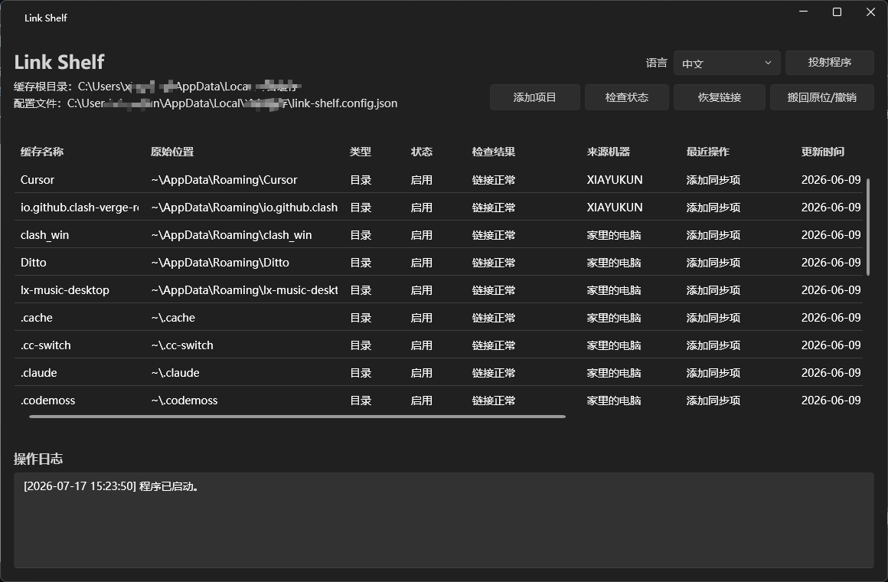

# Link Shelf

[中文主页](README.md)

Windows config mover and symlink tool: collect scattered app settings, dotfiles, and small state folders into one cache root, then restore original paths with symbolic links.

It is useful for organizing developer environments, AI coding tool settings, terminal/editor configuration, and small app state. Backup and sync are handled by tools you choose; Link Shelf handles local path relocation, link restoration, and health checks.

**Download:** [LinkShelf.exe](https://github.com/xiayukun/LinkShelf/releases/latest/download/LinkShelf.exe) | [Full user guide](docs/user-guide.en.md) | [Latest release](https://github.com/xiayukun/LinkShelf/releases/latest)

> **v2.0.0 highlights**: All windows upgraded to WPF-UI FluentWindow with unified dark theme and custom message boxes. See [release notes](docs/release-notes-v2.0.0.en.md).

## Quick Start

1. Download `LinkShelf.exe`.
2. Put it in the folder you want to use as the cache root.
3. Double-click it and choose `Add item`.
4. Select a file or directory.
5. Link Shelf moves the content and creates a symbolic link at the original path.
6. To restore later, put the app back in the same cache root and choose `Restore links`.

## Core Features

- Move files or directories into a cache root and create Windows symbolic links.
- Restore, check, and undo managed items.
- Detect broken links, missing cache items, wrong link targets, and target-path conflicts.
- Recommend common developer tool, editor, terminal, package-manager, and AI coding tool config paths.
- CLI `check --json` and `recommended --json` output for automation and AI assistants.
- `Project app` can hard-link the same exe into another cache-root entry point.

## Good Fit

- **Developers**: Organise dotfiles, editor, terminal, and package-manager config (VS Code, Cursor, JetBrains, Neovim, PowerShell, Windows Terminal, etc.).
- **AI tool users**: Manage settings and state directories for Cursor, Codex, Claude Desktop, Gemini, Continue, aider, Cline, and other AI coding tools.
- **System migration or reinstall**: Gather scattered application settings into one cache root, place the app on a new machine, and restore all links in one click.
- **Keep original paths, centralise content**: Your installation and config paths stay unchanged; your trusted sync or backup tool handles the actual files.

## Caution

Link Shelf is not sync software, and it does not decide which caches are safe to share across machines. Do not blindly sync large caches, databases, browser profiles, folders used by running apps, or paths containing tokens and local history.

See the [full user guide](docs/user-guide.en.md) for GUI usage, CLI commands, config structure, privacy notes, and maintainer details.
