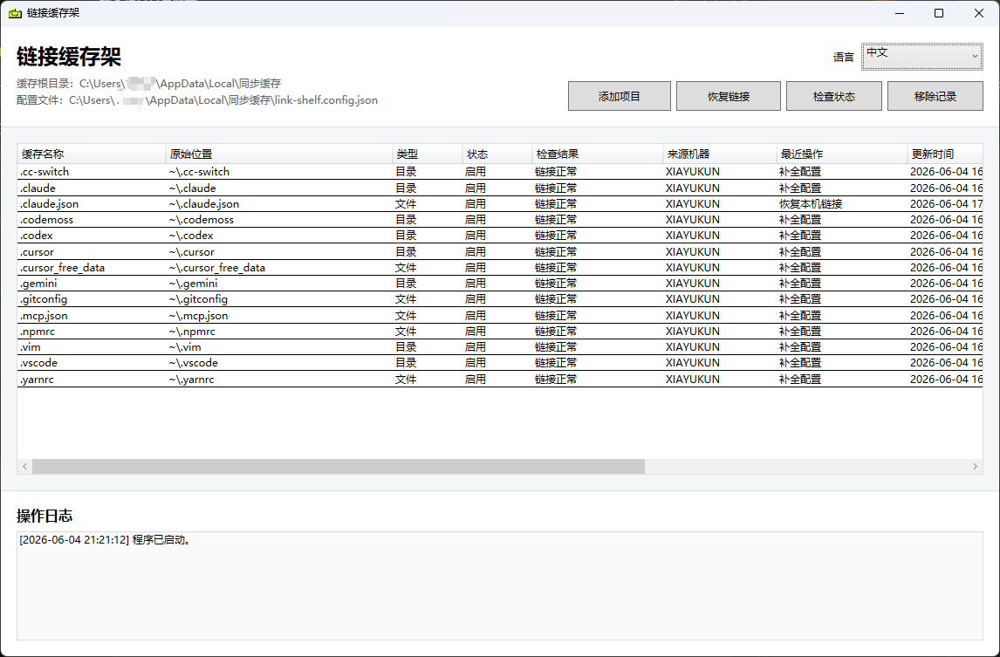

# Link Shelf

[English](README.en.md)

Windows 配置迁移与符号链接工具：把分散的应用设置、dotfiles 和小型状态目录收进一个缓存根目录，再用符号链接恢复原路径。

适合整理开发环境、AI 编程工具配置、终端/编辑器设置和小型应用状态。备份或同步交给你信任的工具，Link Shelf 只负责本机路径搬迁、链接恢复和健康检查。

**下载：** [LinkShelf.exe](https://github.com/xiayukun/LinkShelf/releases/latest/download/LinkShelf.exe) | [完整用户指南](docs/user-guide.md) | [最新发布页](https://github.com/xiayukun/LinkShelf/releases/latest)

## 快速开始

1. 下载 `LinkShelf.exe`。
2. 把它放进你想作为缓存根目录的文件夹。
3. 双击打开，点击 `添加项目`。
4. 选择文件或目录。
5. Link Shelf 会移动内容，并在原位置创建符号链接。
6. 需要恢复时，把程序放回同一个缓存根目录，点击 `恢复链接`。

## 核心能力

- 移动文件或目录到缓存根目录，并创建 Windows 符号链接。
- 恢复、检查、撤销已管理项目。
- 检测损坏链接、缺失缓存项、错误链接目标和目标路径冲突。
- 推荐常见开发工具、编辑器、终端、包管理器和 AI 编程工具配置路径。
- 命令行支持 `check --json`、`platform` 和 `recommended --json`，适合自动化和 AI 助手读取。
- `投射程序` 可用硬链接把同一个 exe 放到另一个缓存根目录入口。

## 适合谁

- 想整理 Windows 上分散配置的人。
- 想备份或迁移 dotfiles、编辑器设置、AI 编程工具状态的人。
- 想用符号链接保留原路径，同时把内容集中管理的人。

## 注意

Link Shelf 不是同步软件，也不会替你判断哪些缓存适合跨机器共享。不要盲目同步大型缓存、数据库、浏览器资料、正在运行程序占用的目录，或包含令牌和本地历史的路径。

当前可下载程序仍是 Windows 版。2.0 起源码拆出 `LinkShelf.Core`，为未来 macOS 前端做准备，但 mac 版还需要单独开发和真机验证。

更多用法、CLI、配置结构、隐私说明和维护信息见 [完整用户指南](docs/user-guide.md)。
